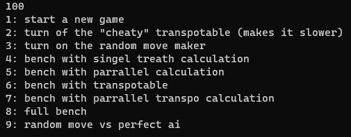

# TikTakToe

## play

the engine is played with the numpad. it is very self explaining.

- first the egine ask my to play or type 0 to let it move.
- I play on square 5
- My move is on the board
- The engine answers 
- The engine give back his evaluation
	 - 0 = draw, 1000 = X is winning, -1000 = O is winning
	 - the evaluation is changes that the ai wins against random ai
	 - in this example 742 means that O has 74.2% change of wining against random moves

**good luck**
## menu 

If you type **100** you enter the menu.

 

 - option 1: is to start a new game
 - option 2: is to change the AI to the AIMulti.cs class, this is the ai of v1.1. (I don't clear the transpo table between moves so i would think of this as a cheat)
 - option 2: can also be to change it back
 - option 3: is to set the AI to a random Move maker
 - option 3: can also be to change it back
 - option 4: benches singlethreated ai with a blank board
 - option 5: benches multithreated ai with a blank board
 - option 6: benches the transpo ai with a blank board and after 2 moves.
 - option 7: benches multithreated transpo ai 
 - option 8: runs a full benchmarking suite with:
	- multi to warm up the cores
	- all the ai from a startup config and a blank board
	- all the ai with a second move
	- the ai's (running) from startup
- option 9: allows you to let the ai play vs a random move generator and see the results
